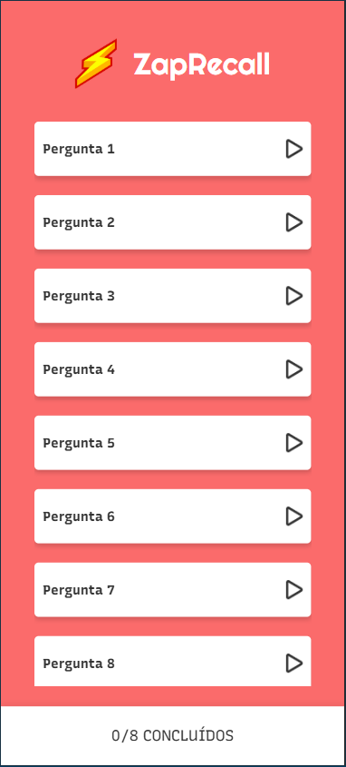

# Zap Recall ⚡

## Descrição do Projeto

Zap Recall é um aplicativo de flashcards desenvolvido para auxiliar nos seus estudos e revisões de conteúdo. A dinâmica é simples e eficaz: cada cartão apresenta uma pergunta ou afirmação, e o desafio é lembrar da resposta antes de virar o cartão. Ao recordar instantaneamente a resposta, você tem um verdadeiro "Zap!" ⚡, indicando que aquele conteúdo está bem fixado na sua memória. O app te ajuda a identificar os tópicos que você domina e aqueles que precisam de mais atenção.

## Tecnologias Utilizadas

Este projeto foi desenvolvido utilizando as seguintes tecnologias:

* **React:** Uma biblioteca JavaScript para construção de interfaces de usuário.
* **Vite:** Um construtor de projetos extremamente rápido e uma ferramenta de desenvolvimento de última geração para React.
* **Styled Components:** Uma biblioteca que permite escrever estilos CSS dentro dos seus componentes React de forma elegante e intuitiva.

## Como Utilizar

Você pode experimentar o Zap Recall diretamente no seu navegador através do seguinte link:

[Link do Deploy no Vercel](https://zap-recall-lime-eight.vercel.app)

## Imagem do Projeto

## Funcionalidades Principais

* Apresentação de flashcards com perguntas/afirmações.
* Mecânica de "virar" o cartão para revelar a resposta.
* Interface intuitiva e fácil de usar.
* Ótimo para revisar conteúdos de forma dinâmica e divertida.

## Autor

Yasmim Cabral